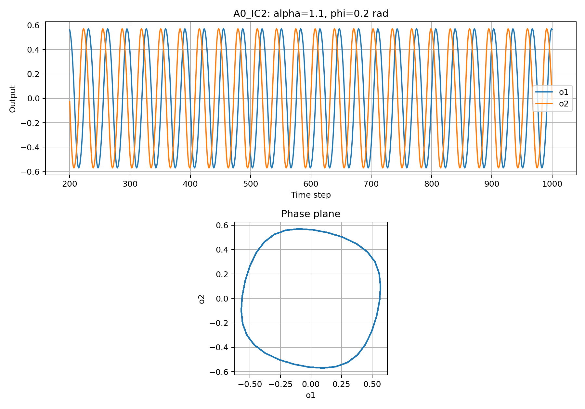
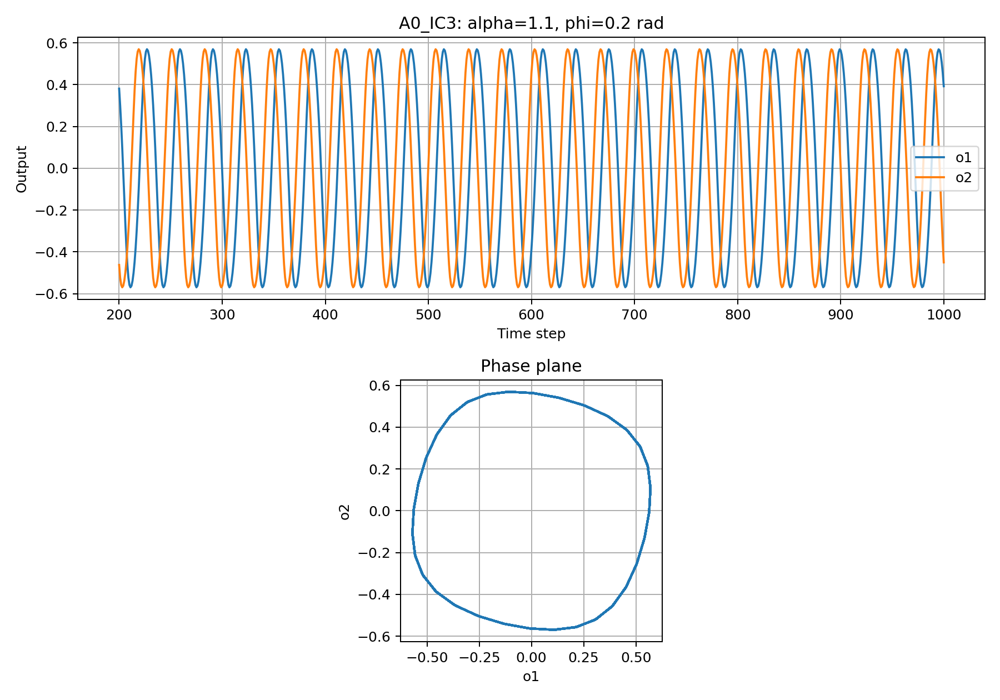
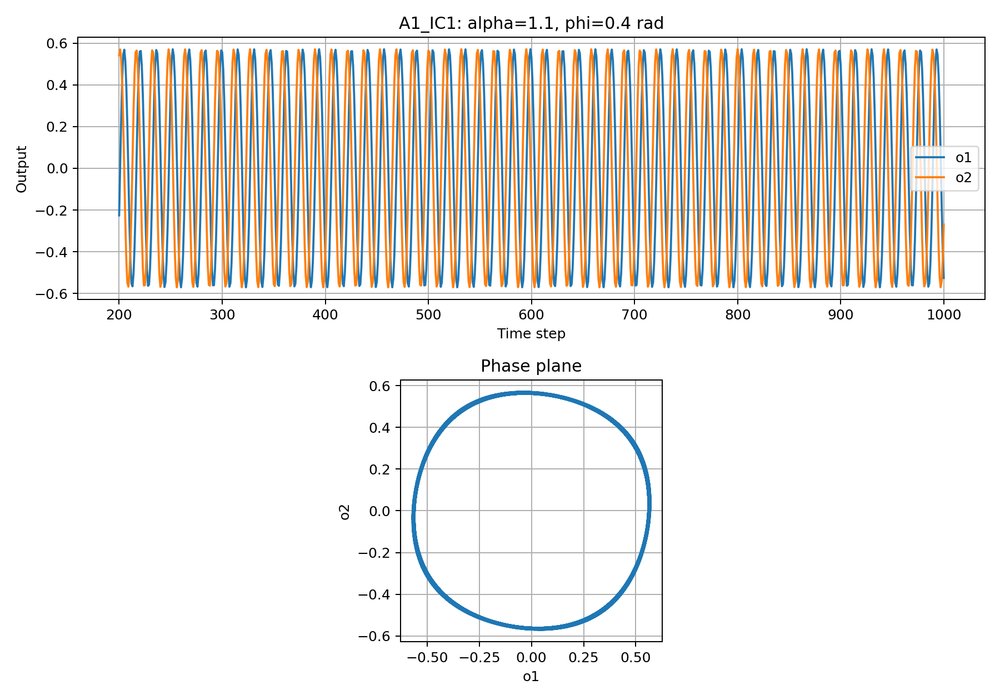
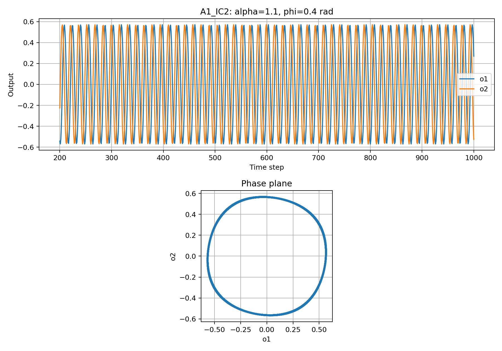
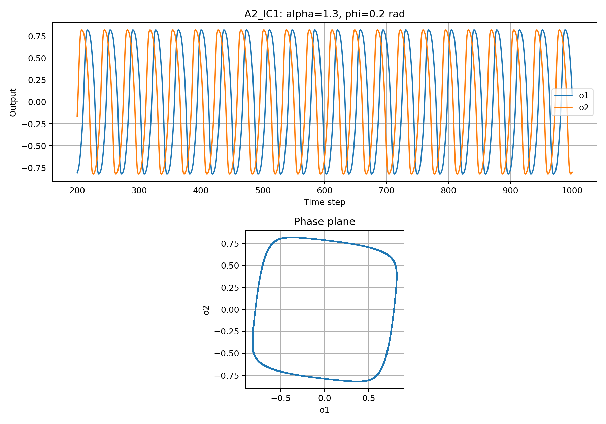
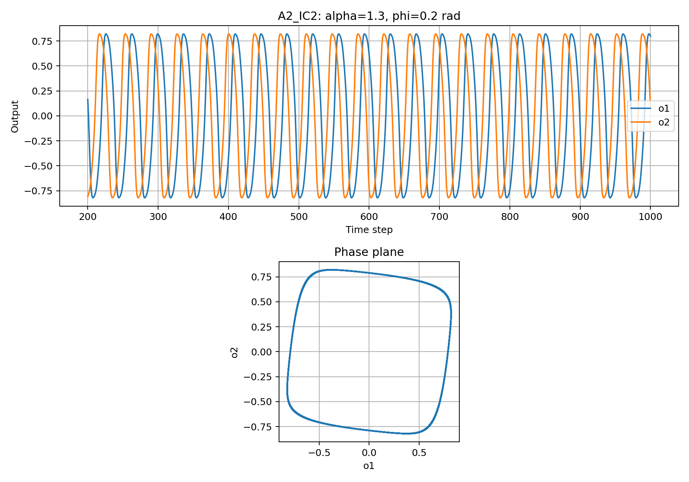
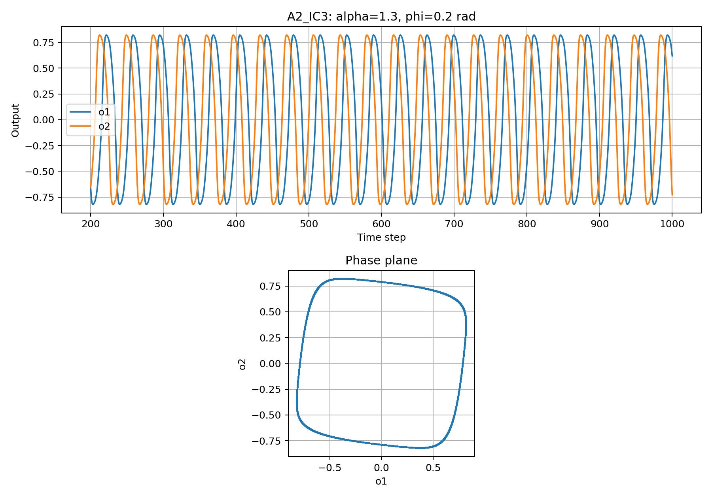

# ผลการทดลอง Lab A: SO(2) CPG

ชื่อผู้จัดทำ: [อิทธิพล เเป้นอ้อย]
รหัสนักศึกษา: [6752500053]
กลุ่ม: [ddkp]

## 1. วัตถุประสงค์

ศึกษาผลของการเปลี่ยนพารามิเตอร์ alpha และ phi ต่อแอมพลิจูด
คาบ และความต่างเฟสของสัญญาณ o1 และ o2
รวมถึงเปรียบเทียบผลเมื่อใช้ค่าเริ่มต้นต่างกัน

## 2. เงื่อนไขการทดลอง

| ชุดทดลอง | alpha | phi (rad) | สิ่งที่เปลี่ยน |
|---|---:|---:|---|
| A0 | 1.1 | 0.2 | เงื่อนไขตั้งต้น |
| A1 | 1.1 | 0.4 | เพิ่ม phi โดยคง alpha |
| A2 | 1.3 | 0.2 | เพิ่ม alpha โดยคง phi |

แต่ละเงื่อนไขใช้ค่าเริ่มต้นของ activation จำนวน 3 ชุด:

| ค่าเริ่มต้น | a1(0) | a2(0) |
|---|---:|---:|
| IC1 | 0.1 | 0.0 |
| IC2 | 0.0 | 0.1 |
| IC3 | 0.1 | 0.1 |

- รวมทั้งหมด 9 การทดลอง
- อัปเดต 1,000 รอบต่อการทดลอง
- เก็บข้อมูลดิบตั้งแต่ t = 0 ถึง 1,000
- วิเคราะห์ช่วง t = 200 ถึง 1,000 โดยตัด 200 steps แรก
- ใช้สมการ o1 = tanh(a1) และ o2 = tanh(a2)
- อัปเดต activation ทั้งสองตัวจาก output ชุดเดียวกัน

## 3. วิธีรัน

ใช้ Python และติดตั้ง matplotlib:

```powershell
python -m pip install matplotlib
```

เปิด Terminal ในโฟลเดอร์ lab_03 แล้วรัน:

```powershell
python lab_a.py
python analyze_lab_a.py
```

ผลลัพธ์อยู่ในโฟลเดอร์ results/lab_a ประกอบด้วยข้อมูลดิบ CSV
จำนวน 9 ไฟล์ รูปกราฟ PNG จำนวน 9 ไฟล์ และ summary_lab_a.csv

## 4. วิธีวัดผล

- แอมพลิจูด = (ค่าสูงสุด - ค่าต่ำสุด) / 2
- คาบ = ระยะห่างเฉลี่ยระหว่างยอดคลื่นที่ติดกันของสัญญาณเดียวกัน
- ความถี่ = 1 / คาบ หน่วยรอบต่อ step
- จับคู่ยอด o1 กับยอด o2 ที่ใกล้ที่สุด โดยตัดยอดใกล้ขอบช่วงข้อมูล
- lag = เวลายอด o2 - เวลายอด o1
- phase lag = 360 × lag เฉลี่ย / คาบเฉลี่ยของสองสัญญาณ

ค่าลบของ phase lag หมายถึง o2 นำหน้า o1 ตามนิยามที่ใช้ในโค้ด

เกณฑ์ตรวจเบื้องต้นที่เลือกใช้ในโค้ด:
ต้องพบอย่างน้อย 3 ยอดต่อสัญญาณ
ส่วนเบี่ยงเบนมาตรฐานของคาบต้องไม่เกิน 10% ของคาบเฉลี่ย
คาบของสองสัญญาณต้องต่างกันไม่เกิน 5% ของคาบเฉลี่ย
และต้องจับคู่ยอดได้อย่างน้อย 3 คู่

สถานะ ok หมายถึงผ่านเกณฑ์ตรวจเหล่านี้
ค่าที่วัดมีข้อจำกัดจากการเก็บข้อมูลทุก 1 step
และยังไม่ได้แปลงความถี่เป็น Hz เพราะไม่ได้กำหนดเวลาจริงต่อ step

## 5. ผลการทดลอง

| การทดลอง | แอมพลิจูด o1 | แอมพลิจูด o2 | คาบ o1 (steps) | คาบ o2 (steps) | ความถี่ o1 (รอบ/step) | Phase lag (องศา) |
|---|---:|---:|---:|---:|---:|---:|
| A0_IC1 | 0.5698 | 0.5698 | 32.00 | 32.00 | 0.03125 | -90.00 |
| A0_IC2 | 0.5698 | 0.5698 | 32.00 | 32.00 | 0.03125 | -90.00 |
| A0_IC3 | 0.5698 | 0.5698 | 32.00 | 32.00 | 0.03125 | -90.00 |
| A1_IC1 | 0.5704 | 0.5704 | 15.76 | 15.76 | 0.06345 | -90.44 |
| A1_IC2 | 0.5704 | 0.5704 | 15.76 | 15.76 | 0.06345 | -89.51 |
| A1_IC3 | 0.5704 | 0.5704 | 15.76 | 15.76 | 0.06345 | -90.44 |
| A2_IC1 | 0.8212 | 0.8212 | 36.76 | 36.76 | 0.02720 | -89.60 |
| A2_IC2 | 0.8212 | 0.8212 | 36.76 | 36.76 | 0.02720 | -90.09 |
| A2_IC3 | 0.8212 | 0.8212 | 36.71 | 36.76 | 0.02724 | -90.15 |

ทุกการทดลองมีสถานะ ok จากโค้ดวิเคราะห์
ตัวเลขในตารางปัดเศษเพื่อให้อ่านง่าย

[เปิดผลวิเคราะห์ฉบับเต็ม](results/lab_a/summary_lab_a.csv)

## 6. กราฟและการอภิปรายผล

### A0: เงื่อนไขตั้งต้น


เมื่อ alpha = 1.1 และ phi = 0.2 rad สัญญาณทั้งสองแกว่งซ้ำ
โดย IC1 มีแอมพลิจูดประมาณ 0.5698 และคาบ 32 steps
สัญญาณ o2 นำหน้า o1 อยู่ 8 steps หรือหนึ่งในสี่รอบ
จึงมี phase lag เท่ากับ -90 องศา
กราฟ phase plane มีลักษณะเป็นวงปิด





ค่าเริ่มต้นทั้งสามชุดให้แอมพลิจูดและคาบหลัง warmup ใกล้เคียงกัน
แม้ตำแหน่งยอดคลื่นตามเวลาอาจต่างกัน

### A1: ผลของการเพิ่ม phi



เมื่อเพิ่ม phi จาก 0.2 เป็น 0.4 rad โดยคง alpha = 1.1
คาบลดจาก 32 เป็น 15.76 steps
ความถี่จึงเพิ่มขึ้นประมาณ 2.03 เท่า
ขณะที่แอมพลิจูดประมาณ 0.5704 ใกล้เคียงกับ A0
แสดงว่าในเงื่อนไขที่ทดลอง การเพิ่ม phi ทำให้สัญญาณแกว่งเร็วขึ้น
โดยความสูงของคลื่นเปลี่ยนเพียงเล็กน้อย




ทั้งสามค่าเริ่มต้นให้คาบและแอมพลิจูดใกล้เคียงกัน
และ phase lag อยู่ใกล้ -90 องศา

### A2: ผลของการเพิ่ม alpha



เมื่อเพิ่ม alpha จาก 1.1 เป็น 1.3 โดยคง phi = 0.2 rad
แอมพลิจูดเพิ่มจากประมาณ 0.5698 เป็น 0.8212
และคาบของ IC1 เพิ่มจาก 32 เป็นประมาณ 36.76 steps
ทำให้สัญญาณแกว่งช้าลง
กราฟ phase plane มีลักษณะคล้ายสี่เหลี่ยมมุมมนมากขึ้น
แสดงว่า alpha ส่งผลทั้งต่อแอมพลิจูด คาบ และรูปร่างของสัญญาณ





ทั้งสามค่าเริ่มต้นให้ผลหลัง warmup ใกล้เคียงกัน
โดยมีความต่างเล็กน้อยของคาบและ phase lag ที่วัดได้

## 7. สรุปผล

1. เมื่อคง alpha = 1.1 แล้วเพิ่ม phi จาก 0.2 เป็น 0.4 rad
   ความถี่เพิ่มขึ้นประมาณสองเท่า โดยแอมพลิจูดใกล้เดิม
2. เมื่อคง phi = 0.2 rad แล้วเพิ่ม alpha จาก 1.1 เป็น 1.3
   แอมพลิจูดและคาบเพิ่มขึ้น
3. ทุกเงื่อนไขมี phase lag ของ o2 เทียบกับ o1 ใกล้ -90 องศา
   หมายถึง o2 นำหน้า o1 ประมาณหนึ่งในสี่รอบ
4. ค่าเริ่มต้นทั้งสามชุดให้แอมพลิจูดและคาบหลัง warmup ใกล้กัน
   แต่ไม่ได้หมายความว่าสัญญาณต้องมียอดตรงเวลาเดียวกัน
5. ผลนี้เป็นการจำลองสัญญาณ CPG และยังไม่ได้ทดสอบ
   ความเสถียรในการเดินของหุ่นยนต์จริง